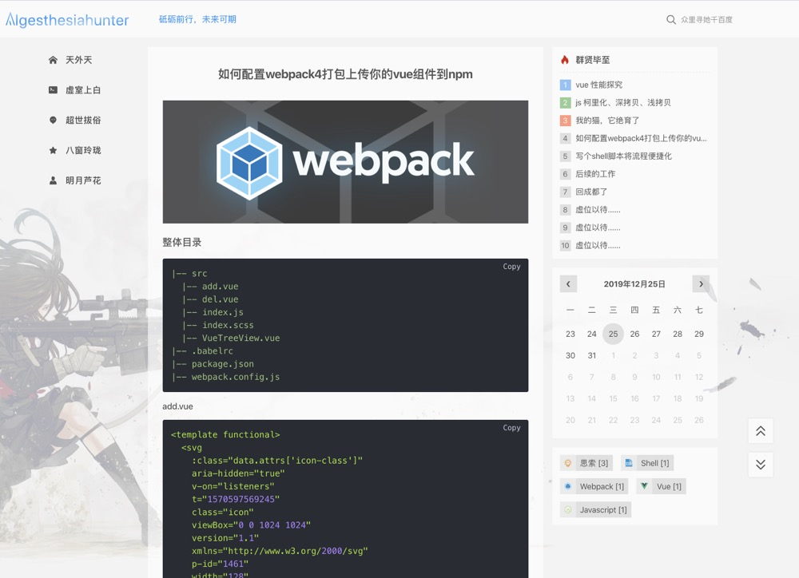

<p align="center">
  <a style='padding:20px 0' href="https://github.com/Algesthesiahunter/algesthesiahunter.me" target="blank">
    
  </a>
</p>

# algesthesiahunter.me

## Introduction

**Online site:** https://algesthesiahunter.top

## Screenshot




---

## Development

```bash
$ npm i
$ npm run dev
```
